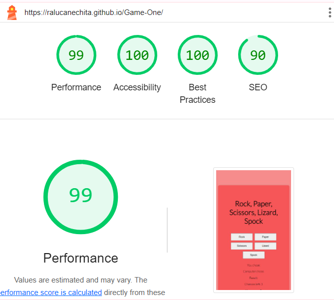

# Rock, Paper, Scissors, Lizard, Spock Game

This is a simple web-based game of "Rock, Paper, Scissors, Lizard, Spock". The game allows users to play against the computer and keeps track of their score over three rounds. After three chances, the game displays a message indicating whether the player won or lost.

## Features
Play "Rock, Paper, Scissors, Lizard, Spock" against the computer.
Keeps track of the player's score.
Displays the remaining chances.
Shows a final game over message indicating if the player won or lost.

## Playing the Game:

- Click one of the five buttons to make your choice: Rock, Paper, Scissors, Lizard, or Spock.
- The computer will make a random choice.
- The result of the round will be displayed along with the choices made by both the player and the computer.
- The number of chances left and the player's score will be updated.
- After three chances, a final message will indicate if the player won or lost.

## Rules
- Rock crushes Scissors and Lizard.
- Paper covers Rock and disproves Spock.
- Scissors cuts Paper and decapitates Lizard.
- Lizard eats Paper and poisons Spock.
- Spock smashes Scissors and vaporizes Rock.

## Technologies Used
- HTML: The structure of the web page.
- CSS: Styling of the web page.
- JavaScript: Game logic and interactivity.

When a player wins the game, the message "Congratulations! You won the game! Refresh the page to play again." will pop up to congradulate the player and let him/her know that the game is over and how to play again.

When a player loses the game, the message "Sorry,you lost the game.Refresh the page to play again." will pop up.

## Testing

- I have tested that this page works in different browsers: Chrome, Edge and Safari.
- I checked that the project functions and is responsive on all standard screen sizes using the devtools device toolbar.

## Validator

- HTML

No errors were returned when passing through the official W3C validator.

- CSS 

No errors were returned when passing through the official Jigsaw validator.

- Performance 

I have confirmed the website accessibility and performance by running through lighthouse in devtools.

## Unfixed bugs

There are no unfixed bugs.

## Deployment

- This site was deployed to GitHub pages.
- The live link can be found here - [Rock, Paper, Scissors, Lizard, Spock](https://ralucanechita.github.io/Game-One/).

## Credits
### Content
- I have tried to create all the code myself and rely only on the courses lessons. When stuck or unsure I have looked back and taken inspiration from CI Love Maths project.
- Occasionally I have looked up answers to my questions on coders forums or Youtube channels.
